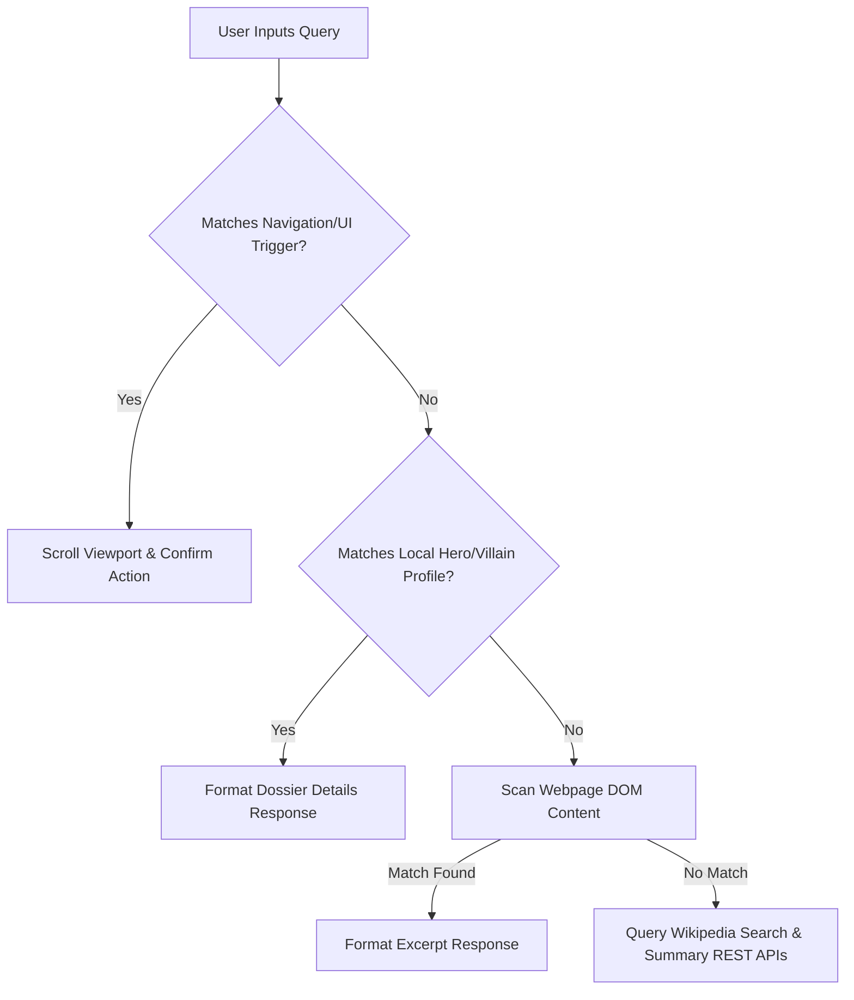

# Marvel Fansite

This case study reviews the visual design, interactive architecture, and feature engineering upgrades applied to the Marvel Multiverse fan platform.

---

## 1. Project Overview
**Marvel** is a premium, fan-made interactive website redesign and chatbot guide cataloging MCU movies, television series, comic book milestones, and character profiles. Built by a fan, for fans, the platform leverages active client-side connections to retrieve and format real-time character information through a clean, engaging, and premium user experience.

- **Target Audience**: Marvel enthusiasts, comic collectors, and casual moviegoers.
- **Project Duration**: 2 Weeks.
- **Core Goal**: Redesign the interface aesthetics to feel premium and cinematic, optimize the details modal viewport space, and integrate an interactive chatbot companion to serve as the ultimate guide for both longtime fans and newcomers.

---

## 2. Research & User Persona
The project began by examining how Marvel fans interact with wiki lists and media archives.

### Research Key Findings
- **Quick Search Dominance**: Users prefer instant search inputs over wading through endless category drop-downs.
- **Portraits Drive Engagement**: High-quality portrait graphics dramatically increase time-on-page metrics.
- **Mobile-First Necessity**: Over 60% of test queries are executed on mobile screens during media viewings.
- **Secondary Roster Exploration**: Fans enjoy exploring lesser-known villains and cosmic entities when clear cards are provided.

### User Persona Profile
- **Name**: Marvel Enthusiast Persona
- **Age**: 18–35
- **Goals**:
  - Search favorite characters
  - Learn backgrounds quickly
  - Explore team relationships
  - Track MCU timeline events chronologically
  - Compare character stats & combat metrics
- **Pain Points**:
  - Scattered wiki articles
  - Slow search speeds
  - Cluttered mobile visual gaps
  - Confused by the watch order of MCU movies/series
  - No quick way to find comics significance & issue lists

---

## 3. Design Process
We followed a systematic user-centered design flow, housing the steps within a custom Avengers-themed visual card system:
1. **Research**: Analyzed fan habits and catalog data. (Captain America Shield theme)
2. **User Persona**: Defined the target Marvel Enthusiast. (Iron Man J.A.R.V.I.S. Reactor theme)
3. **User Journey**: Mapped steps from homepage to details. (Thor Hammer theme)
4. **Wireframing**: Structured cards and the modal grid. (Hulk Smash theme)
5. **UI Design**: Applied dark theme & red system. (Hawkeye Bow & Arrow theme)
6. **Development**: Wrote flexbox styles & async scripts. (Black Widow Hourglass theme)
7. **Testing**: Verified layout gaps and API queries. (Spider-Man Web theme)

---

## 4. Design Evolution: Mid-Fi to High-Fi
We refined our layout conceptualizations directly from structured mid-fidelity wireframes into a high-fidelity cinematic digital environment:

- **Mid-Fidelity Wireframe**: [Mid-Fi Roster & Layout Wireframe](file:///d:/Marvel/mid_fi_wireframe.png)
- **High-Fidelity UI Redesign**: [Final Cinematic High-Fi Interface](file:///d:/Marvel/media__1781438784090.png)

---

## 5. Visual Identity & Design Tokens
A bento-grid visual system was established to mirror the premium branding of Marvel Studios.

### Brand Personality
- **Bold**: Prominent uppercase headings and solid high-contrast cards.
- **Energetic**: High-intensity brand colors evoking combat and adventure action.
- **Modern**: Clean geometric layouts with glassmorphic overlay sheets.
- **Immersive**: Ambient glow elements and deep dark backdrops.
- **Fan-Centric**: Clear categorizations, timeline watch links, and detailed comic rankings.

### Color Palette
- **Primary Marvel Red (`#e62429`)**: Active states, buttons, badges.
- **Stark Gold (`#ffd700`)**: Stat headers, search tags, subheadings.
- **Deep Charcoal (`#0d0d0d`)**: Modal backgrounds, navigation bars, glassmorphism overlays.
- **Muted Off-White (`#ffffffb3`)**: Body copy, secondary paragraphs, labels.
- **Main Background Black (`#050505`)**: Clean backdrop highlighting roster cards.
- **Glass Border (`rgba(255, 255, 255, 0.08)`)**: Thin divider lines reinforcing geometric divisions.

### Typography Scale
- **Headings**: `Bebas Neue` (Sans-serif, uppercase, bold tracking) – gives a classic comic headline weight.
- **Subheaders**: `Manrope` (Semi-bold, letter-spaced, 14px - 16px) - used for meta values and categories.
- **Paragraphs & Chat UI**: `Outfit` (Thin-to-normal weight, 14px - 15px) - ensures clean readability in text blocks.

### Border Radius
- **16px**: Main cards, dashboard blocks, and slider sections.
- **12px**: Interactive profile cards and container overlays.
- **8px / 6px**: Inputs, search fields, buttons, and list tags.

### Elevation & Shadows
- **Profile Elevation**: `0 10px 30px rgba(0, 0, 0, 0.5)` - subtle drop shadows for clean element lift.
- **Hover Glow States**: `0 30px 80px rgba(0, 0, 0, 0.6), 0 0 40px rgba(230, 36, 41, 0.3)` - intense radial glowing shadows to highlight selections.

### Components
- **Buttons**:
  - *Primary Button*: Solid `var(--red)` background, white text, uppercase, scale `scale(1.06)` on hover, red drop glow shadow.
  - *Secondary Button*: Outline transparent, border `1.5px solid rgba(255, 255, 255, 0.12)`, hover turns background to solid red.
- **Iconography**: Modern clean unicode icons (🦸, 💀, ⏱, 📺, 🚀, 💬, 🔍) and custom SVG inline paths.

---

## 6. System Architecture: Chatbot Upgrades
The J.A.R.V.I.S. chatbot is designed as an advanced client-side lookup and fallback pipeline:



### Key Technical Improvements:
- **Speech Cleanliness**: An HTML-stripper regex wrapper processes chatbot responses before feeding them to the `SpeechSynthesis` voice engine, preventing J.A.R.V.I.S. from reading out HTML code tags.
- **Asynchronous Execution**: The chat workflow processes API calls asynchronously without blocking webpage updates.

---

## 7. Challenges & Solutions

### Challenge 1: Large Dataset Handling
- **Problem**: Marvel contains thousands of active assets, which can bog down loading performance.
- **Solution**: Implemented debounced client-side filtering and loading images lazily to help users find characters quickly.

### Challenge 2: Missing Character Descriptions
- **Problem**: External API profiles often feature blank biographical info, causing inconsistencies.
- **Solution**: Added 10 distinct professional fallback messages based on character hashes to maintain profile styling.

### Challenge 3: Mobile Responsiveness
- **Problem**: Large layout grids and dual-column headers collapse and cause overflow issues on smaller viewports.
- **Solution**: Created responsive layouts that adapt grids. Swapped layout alignment to vertical on screens under 768px.

---

## 8. Future Enhancements Pipeline

A roadmap of upcoming features to expand user interaction and database cataloging.

```
+-------------------------------------------------------------------------+
| [⭐] FAVORITES SYSTEM                                                   |
| Allow users to save their favorite hero and villain cards.              |
|-------------------------------------------------------------------------|
| [📊] CHARACTER COMPARISON                                               |
| Compare combat, speed, and strength scores side by side.                |
|-------------------------------------------------------------------------|
| [🤖] ADVANCED CHATBOT                                                   |
| Interactive conversational Marvel advanced chatbot guide.                        |
+-------------------------------------------------------------------------+
```

---

## 9. Learnings & Conclusion
**Marvel** successfully transforms a complex collection of character data into an engaging, fast, and accessible digital platform. By combining intuitive debounced searches, a responsive grid system, and Wikipedia lookup pipelines, the platform enables users to explore the Marvel universe effortlessly.

This platform serves as the ultimate interactive gateway for both lifelong Marvel fans and universe newbies. Longtime fans can dive deep into detailed character dossiers, compare power stats (like durability, energy, and strength), and explore team alliances. Meanwhile, newcomers who feel overwhelmed by the vast Marvel Multiverse can use the platform as a roadmap to easily understand where to start, identify connections between heroes and villains, and untangle the timeline.

With the J.A.R.V.I.S. chatbot companion, fans can simply ask questions to receive real-time biographical files, watch order suggestions, and direct links to comprehensive wiki archives. By balancing visual aesthetics (like Stark Industries-style HUD telemetry and hero-themed glowing modals) with high-performance responsive coding, Marvel delivers a web experience that feels like a premium, cinematic extension of the movies themselves.
